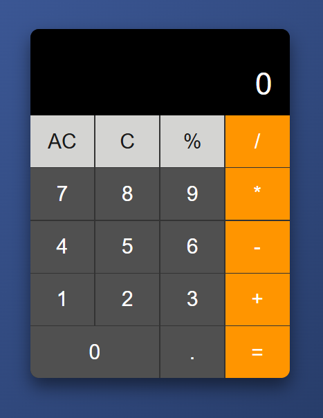

# 🧮 Modern Calculator App

A sleek, responsive calculator application built with **HTML, CSS, and JavaScript**. Features a clean design with smooth animations and full keyboard support.

## ✨ Key Features

- ➕ Basic arithmetic operations (addition, subtraction, multiplication, division)
- 🔢 Decimal point calculation
- ⬅️ Backspace functionality
- 🧹 Clear and clear entry buttons
- ⌨️ Full keyboard support
- 📱 Responsive design for all devices
- 🎨 Modern glassmorphism UI with smooth animations
- 🌓 Light/dark mode toggle
- 💾 Memory functions (MC, MR, M+, M-)

## 🛠️ Built With

- **HTML5** - Semantic structure
- **CSS3** - Modern styling with Flexbox and animations
- **JavaScript** - Core functionality and interactivity
- **Google Fonts** - Poppins font family

## 📸 Preview



## 🚀 Live Demo

👉 [Click here to try the calculator](https://ghazi829.github.io/Calculator/)

## 📁 Project Structure

```
calculator-app/
├── index.html          # Main HTML file
├── style.css           # Complete styling with modern design
├── script.js           # Calculator functionality
├── calculator-preview  # Screenshots and icons
└── README.md           # Project documentation
```

## 🎯 How to Use

1. **Basic Operations**:
   - Click numbers or type them on your keyboard
   - Select an operation (+, -, ×, ÷)
   - Press equals (=) or Enter to get results

2. **Special Functions**:
   - `C` - Clear all
   - `CE` - Clear entry
   - `⌫` - Backspace
   - `%` - Percentage
   - `±` - Toggle positive/negative

3. **Keyboard Support**:
   - Numbers: 0-9
   - Operations: +, -, *, /
   - Enter: Calculate result
   - Escape: Clear all
   - Backspace: Delete last digit

## 🌟 Features in Detail

- **Error Handling**: Prevents invalid operations and division by zero
- **Smooth Animations**: Button press effects and transition animations
- **Responsive Design**: Works perfectly on desktop, tablet, and mobile
- **Memory Functions**: Store, recall, add to, and subtract from memory
- **Theme Switching**: Toggle between light and dark modes

## 🔧 Installation

1. **Clone the repository**:
   ```bash
   git clone https://github.com/ghazi829/Calculator.git
   ```

2. **Navigate to the directory**:
   ```bash
   cd Calculator-App
   ```

3. **Open in browser**:
   - Simply open `index.html` in your web browser
   - Or use a local server for best experience

## 🖥️ Browser Support

- ✅ Chrome (latest)
- ✅ Firefox (latest)
- ✅ Safari (latest)
- ✅ Edge (latest)
- ✅ Mobile browsers

## 🤝 Contributing

Contributions are welcome! Feel free to:
1. Fork the project
2. Create a feature branch
3. Commit your changes
4. Push to the branch
5. Open a Pull Request

## 📜 License

This project is open source and available under the [MIT License](LICENSE).

---

**Developed with  by Pir Ghazi**

*Creating simple solutions with elegant design* 🎯✨
